# Election Integrity Analytics Platform

> A data-driven decision support system for election oversight, anomaly detection, and procedural rule lookup.

---

## 📌 Overview

This project explores how quantitative tools may complement modern election administration systems.

Using a Minnesota-inspired election framework, the system simulates precinct-level election outcomes, detects unusual voting patterns, explains anomalies, and connects observations to legal / procedural election rules such as recounts and audits.

This project is designed for **research, education, and analytics purposes**.

---

## Interactive Dashboard Overview

The project includes a Streamlit-based interactive dashboard that allows users to explore simulated election data, anomaly detection results, and election procedure rules in a visual and user-friendly format.

Key dashboard functions include:

- **Election Summary Metrics**: Displays total precincts, flagged anomalies, average turnout, and absentee voting share.
- **Distribution Analysis**: Visualizes turnout rates and absentee voting behavior across precincts.
- **Outlier Detection View**: Highlights flagged precincts that deviate from normal voting patterns.
- **Scatter Plot Exploration**: Compares turnout and absentee share to identify unusual combinations.
- **Anomaly Type Breakdown**: Summarizes the categories of detected anomalies (turnout spikes, absentee spikes, provisional ballot spikes, etc.).
- **Precinct Search Tool**: Allows users to inspect detailed statistics for any selected precinct.
- **Rules Assistant**: Provides quick natural-language explanations of Minnesota election procedures such as recounts, absentee voting, and audits.

The dashboard demonstrates how data analytics and interpretable AI tools can support election transparency, administrative review, and policy understanding.

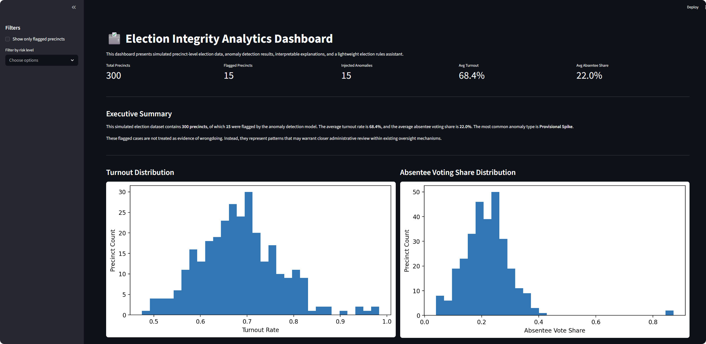
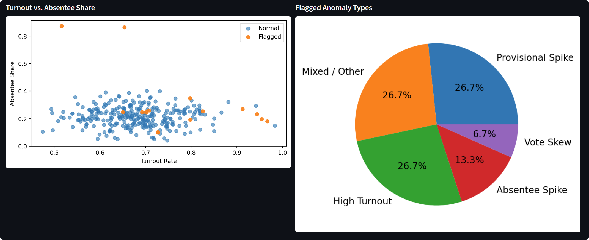
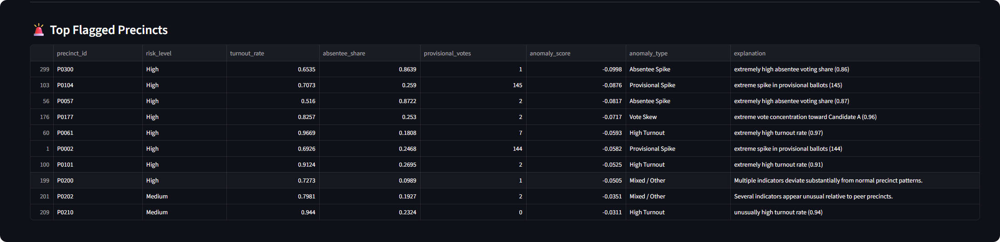
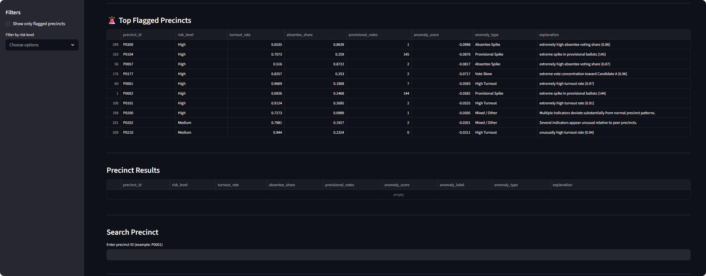
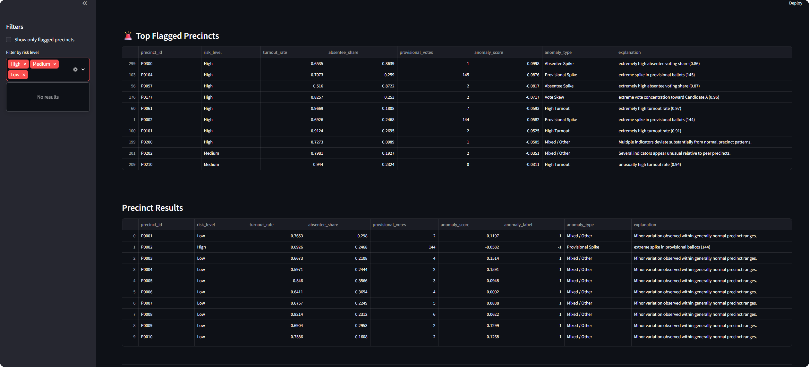
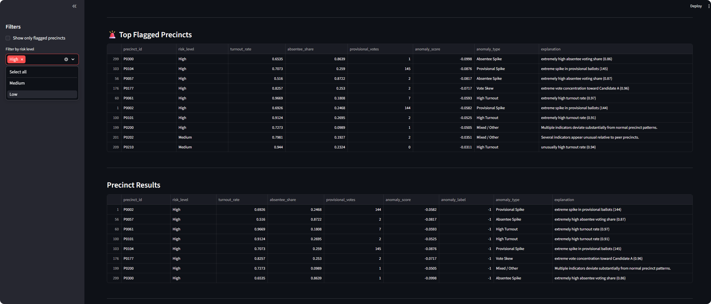
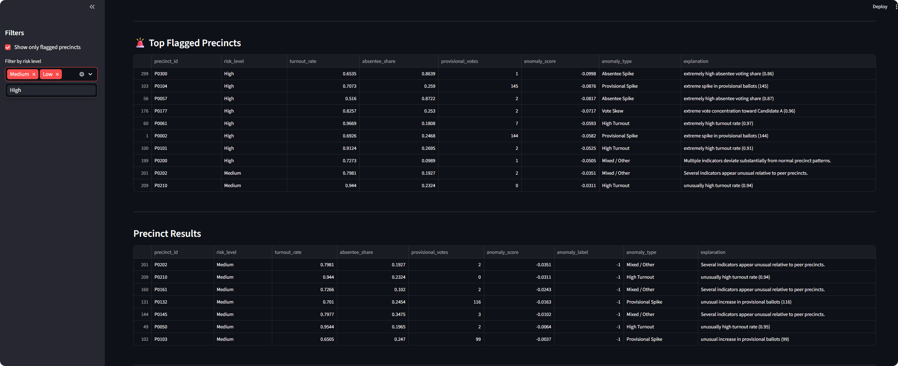
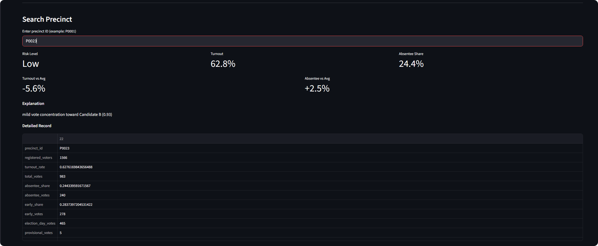
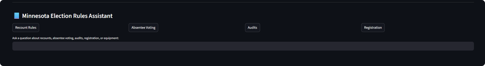
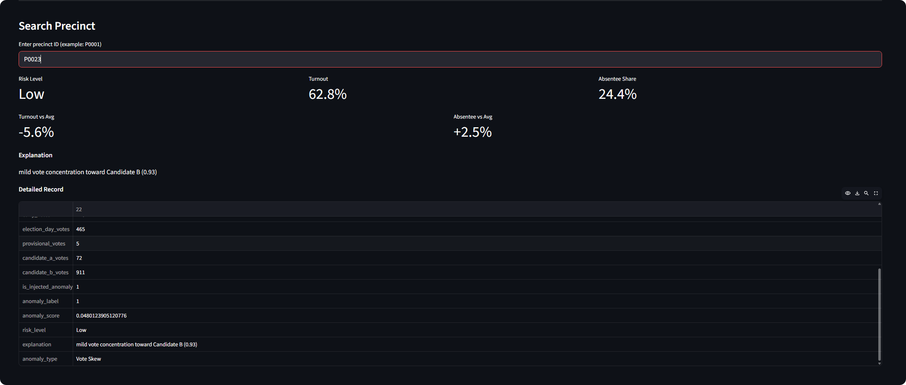
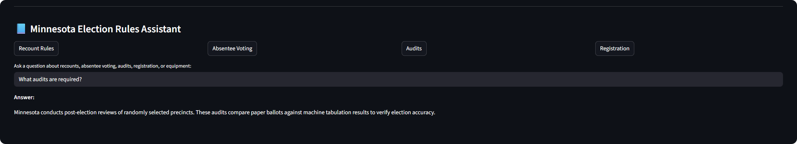
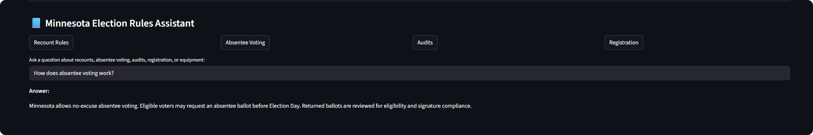

---

## 🚀 Core Features

### 📊 Precinct-Level Election Simulation

Generate synthetic election data across precincts including:

- registered voters
- turnout rates
- absentee voting share
- early voting share
- provisional ballots
- candidate vote totals

---

### ⚠️ Anomaly Detection Engine

Uses Isolation Forest to identify unusual precinct-level patterns such as:

- abnormally high turnout
- absentee vote spikes
- skewed vote distributions
- unusual provisional ballot volume

---

### 🧠 Explainable Analytics

Each flagged precinct receives interpretable explanations.

Example:

```
P0023 flagged for unusually high absentee vote share (0.87)
```

## 📘 Election Rules Assistant

Interactive rule lookup system supporting questions such as:

- What triggers recount in Minnesota?
- How does absentee voting work?
- What audits are required?

## 🏗️ System Architecture

```
Simulation Engine
      ↓
Election Dataset
      ↓
Anomaly Detection
      ↓
Explanation Layer
      ↓
Dashboard + Rules Assistant
```

## 📂 Project Architecture

```
election-analytics/
│
├── data/
│   └── simulated_election_data.csv
│
├── outputs/
│   ├── anomaly_results.csv
│   ├── anomaly_explanations.csv
│   ├── turnout_distribution.png
│   ├── absentee_distribution.png
│   └── anomaly_score_distribution.png
│
├── src/
│   ├── simulation.py
│   ├── anomaly.py
│   ├── explain.py
│   ├── rules.py
│   └── visualization.py
│
├── app.py
├── README.md
├── requirements.txt
├── .gitignore
└── LICENSE
```

## ⚙️ Tech Stack

- Python 3.10
- Anaconda
- pandas
- numpy
- scikit-learn
- matplotlib
- streamlit

## 🖥️ Quick Start

Create Environment

```
conda create -n election-ai python=3.10 -y
conda activate election-ai
pip install pandas numpy scikit-learn matplotlib streamlit
```

Run Modules
```
python src/simulation.py
python src/anomaly.py
python src/explain.py
streamlit run app.py
```

## 📈 Example Outputs

- Turnout distribution
- Absentee voting histogram
- Flagged precinct table
- Search precinct records
- Election procedure Q&A

## 🎯 Use Cases

- Election administration research
- Audit workflow simulation
- Policy education
- Data anomaly detection case study
- Explainable AI demonstration

## 📊 Results & Interpretation

### 1. Turnout Rate Distribution

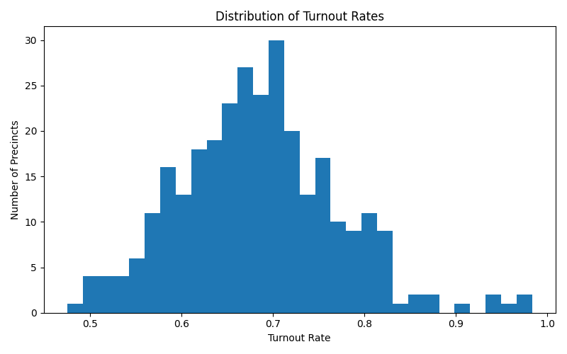

The simulated turnout rates are centered around typical participation levels, with most precincts falling between **60% and 80% turnout**. A small number of precincts exhibit unusually high turnout, which may warrant further review in anomaly detection workflows.

---

### 2. Absentee Voting Share Distribution

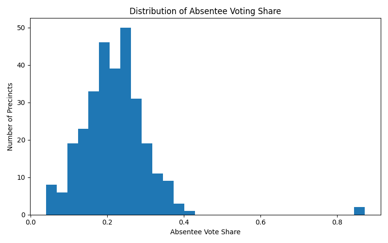

Most precincts display absentee voting shares between **15% and 35%**, reflecting normal variation in mail voting usage. A few extreme outliers show significantly elevated absentee shares, representing potential irregular patterns for administrative review.

---

### 3. Anomaly Score Distribution

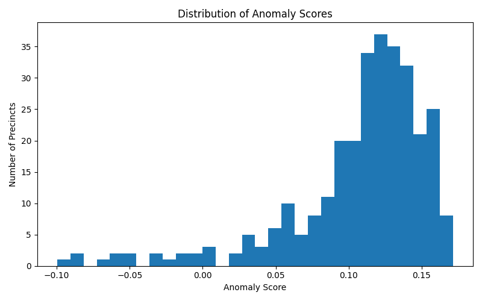

The Isolation Forest model assigns anomaly scores across precincts. Most precincts cluster in the normal range, while a smaller subset receives substantially lower scores and is flagged as anomalous.

These anomalies may correspond to:

- unusually high turnout
- abnormal absentee ballot concentration
- extreme candidate vote imbalance
- elevated provisional ballot counts

---

### 4. Explainable Flagging

Example flagged precinct explanations:

```
P0021 – unusually high turnout rate
P0047 – high absentee vote share
P0113 – abnormal provisional ballot volume
```

This improves transparency by showing why a precinct was flagged rather than relying solely on black-box model outputs.

### 5. Policy Relevance

This project does not claim fraud detection.

Instead, it demonstrates how quantitative tools may assist:

- post-election audits
- recount prioritization
- administrative review workflows
- election operations research

###  6. Results Interpretation


#### Turnout vs. Absentee Share

Most precincts fall within normal turnout and absentee voting ranges.  
Flagged precincts appear as outliers with unusually high turnout, elevated absentee shares, or rare combinations of voting behavior.

#### Flagged Anomaly Types

Among flagged precincts, the most common categories involve turnout spikes, provisional ballot spikes, and absentee voting anomalies.

These results illustrate how data analytics may support election oversight by identifying cases for additional review.

## Key Findings

- 300 simulated precincts analyzed
- 15 precincts flagged by anomaly model
- Interactive dashboard with rule assistant deployed locally
- Explainable AI used for transparency

## ⚖️ Disclaimer

This project does not detect or claim election fraud.

It demonstrates how analytical tools may support existing election oversight mechanisms.

## Future Work

- Integrate real public election datasets
- Multi-state policy comparison
- Additional anomaly detection models
- Natural language legal QA module
- Public deployment
